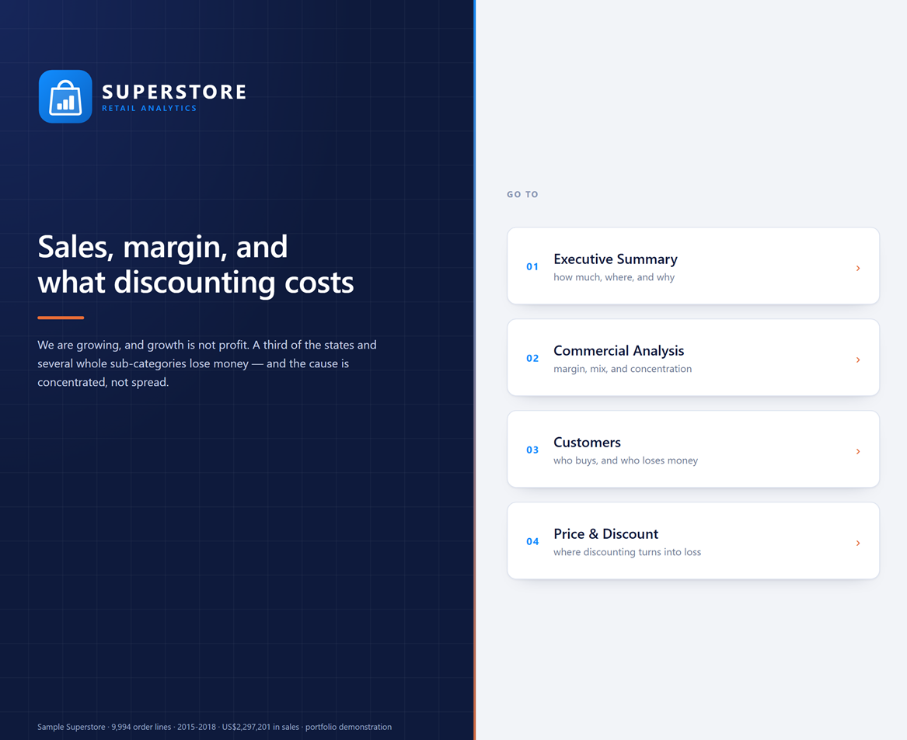
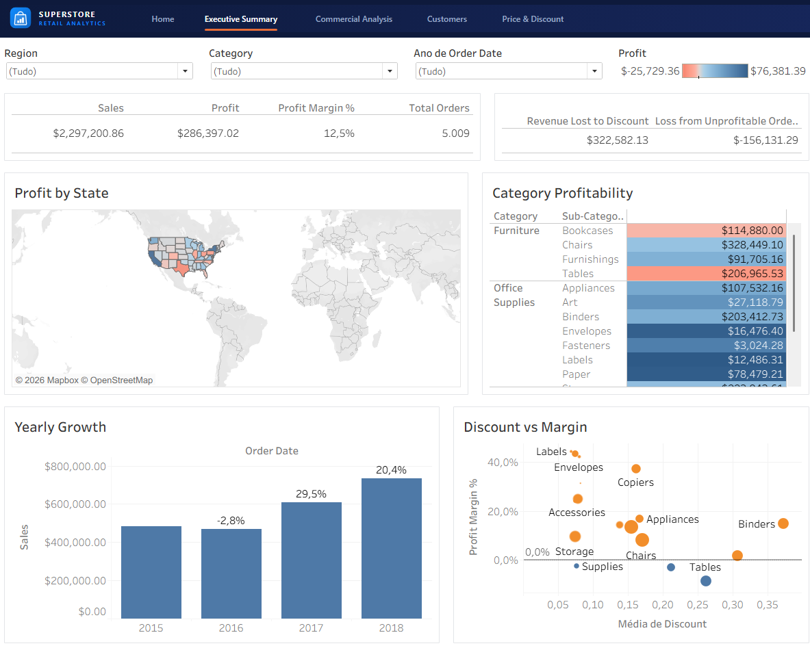
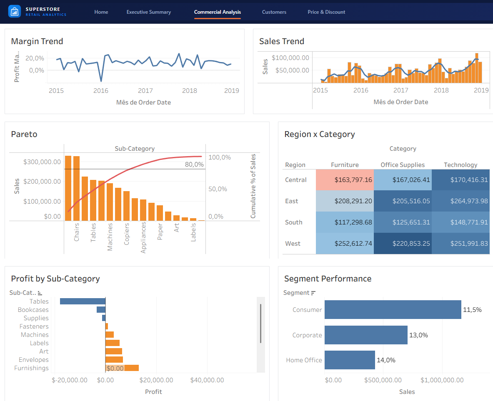
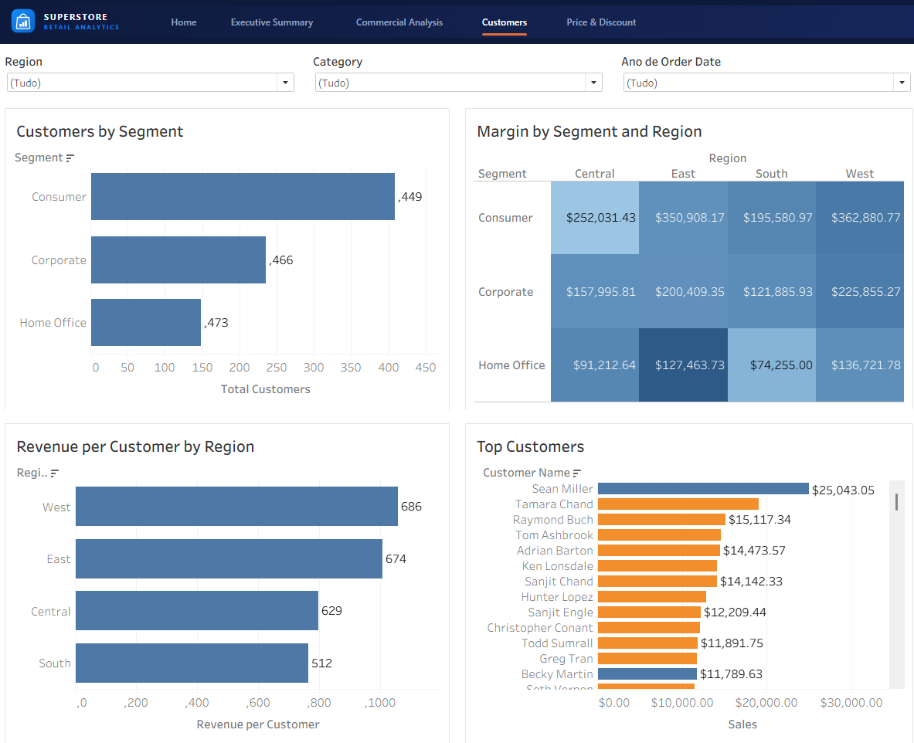
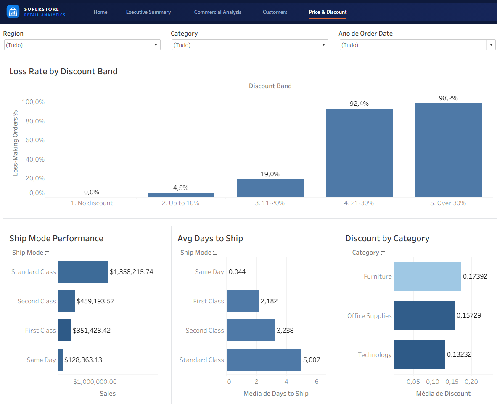

# Tableau — Executive Sales & Profitability Dashboard
> An interactive **Tableau** dashboard on the Superstore dataset, focused on *where the business makes money and where it loses it* — filled profit maps, category profitability, a sub-category Pareto and a discount scatter. Built to Tableau's strengths (mapping, interactivity, visual comparison), and fully specced for reproduction.

<!-- After publishing, replace the line below with your live link:
 -->

---

## Business Context

**Industry:** Retail
**Stakeholders:** Commercial, Finance, and executive leadership
**Business question:** *Which regions, categories and customers are actually profitable, and how much profit is discounting costing us?*

Where the [Power BI project](https://github.com/ANAPBORGES/saas-financial-kpis) frames the Superstore data as **financial KPIs** — revenue growth, customer value and a discount what-if — this Tableau dashboard takes the **executive sales & profitability** angle — geography, product mix, and a hands-on discount lever — leveraging what Tableau does best: mapping, interactivity, and Level-of-Detail analysis.

---

## Dataset

| Field | Details |
|---|---|
| **Source** | Sample Superstore — included at [`data/superstore.csv`](./data/superstore.csv) |
| **Size** | 9,994 order lines · 5,009 orders · 793 customers |
| **Period** | 2015 – 2018 · US$2.30M sales · US$286K profit (12.5% margin) |

Self-contained: the CSV lives in the repo, so the dashboard is reproducible with no external download.

---

## What's in this repo

| File | Purpose |
|---|---|
| [`tableau/dashboard_design.md`](./tableau/dashboard_design.md) | **The design** — layout grid, interaction model, colour roles, type scale, and the reasoning behind each |
| [`tableau/finishing_guide.md`](./tableau/finishing_guide.md) | The last 30 minutes — sorting, titles, reference lines, viz-in-tooltip, colour discipline |
| [`tableau/dashboard_spec.md`](./tableau/dashboard_spec.md) | Sheet-by-sheet spec, dashboard layout, filters and interactions |
| [`tableau/workbook/Portifolio_Tableau.twb`](./tableau/workbook/) | **The workbook** — 5 dashboards, 20 worksheets, sorted, coloured and annotated |
| [`tableau/layout/`](./tableau/layout/) | The header and cover images the dashboards use |
| [`tableau/calculated_fields.md`](./tableau/calculated_fields.md) | Every calculated field in Tableau syntax — profitability metrics and table calculations |
| [`tableau/build_guide.md`](./tableau/build_guide.md) | Step-by-step to build and publish it on Tableau Public (free) |
| [`data/superstore.csv`](./data/superstore.csv) | The dataset |

---

## Tableau techniques demonstrated

- **Filled maps** with a diverging profit palette centred on zero — loss states jump out.
- **Table calculations** — running totals, cumulative % for Pareto, moving averages, YoY growth.
- **Dashboard actions** — click a state to filter every view; global Region/Category/Year filters.

---

## Key insights (validated against the data)

1. **10 of 49 states lose money** — *Texas* (−US$26K) and *Pennsylvania* (−US$16K) are red on the map despite high sales; California (+US$76K) and New York (+US$74K) carry the business.
2. **Furniture is a revenue trap** — it sells almost as much as Technology but returns just a **2.5% profit ratio** (vs 17% for Technology and Office Supplies); *Tables* and *Bookcases* are outright loss-makers.
3. **Discounting is the profit lever** — profit turns negative **above ~20% discount**; orders over 30% discount have an **83% loss rate**.
4. **Concentration** — the top 6 of 17 sub-categories drive ≈ **65% of sales** (Pareto).

---

## Dashboard pages

| Page | What it answers |
|---|---|
| **Home** | cover and navigation |
| **Executive Summary** | how much, where, and why — KPIs, the money at stake, the profit map, yearly growth, discount vs margin |
| **Commercial Analysis** | margin, mix and concentration — margin over time, monthly sales, Pareto, region × category, the loss-makers named |
| **Customers** | who buys and who loses money — value per customer, the segment × region grid, every account ranked |
| **Price & Discount** | where discounting turns into loss — loss rate by discount band, ship mode, discount by category |

Sheet-by-sheet detail in [`dashboard_spec.md`](./tableau/dashboard_spec.md). Every metric
carries the same name as in the Power BI project; the dictionary is at the bottom of
[`calculated_fields.md`](./tableau/calculated_fields.md).

All five pages share one frame — a 56 px header with the mark and the current tab
highlighted, white cards on a `#F2F4F8` ground — the same values as the Power BI report, so
the two projects read as one portfolio.

---

## Live dashboard

🔗 **Tableau Public:** _publishing in progress_ — see [`build_guide.md`](./tableau/build_guide.md).

Publish from a **`.twbx`**, not the `.twb`: the workbook carries a data extract and five
layout images, and only the packaged format takes them along.

| Home | Executive Summary |
|---|---|
|  |  |

| Commercial Analysis | Customers |
|---|---|
|  |  |

| Price & Discount |
|---|
|  |

---

## About

Built by **Ana Paula Borges** · [LinkedIn](https://linkedin.com/in/ana-paula-d-araújo-borges) · [GitHub](https://github.com/ANAPBORGES)

*Senior Data Analyst & Team Leader with 10+ years in BI, DataViz, and Marketing Analytics.*
